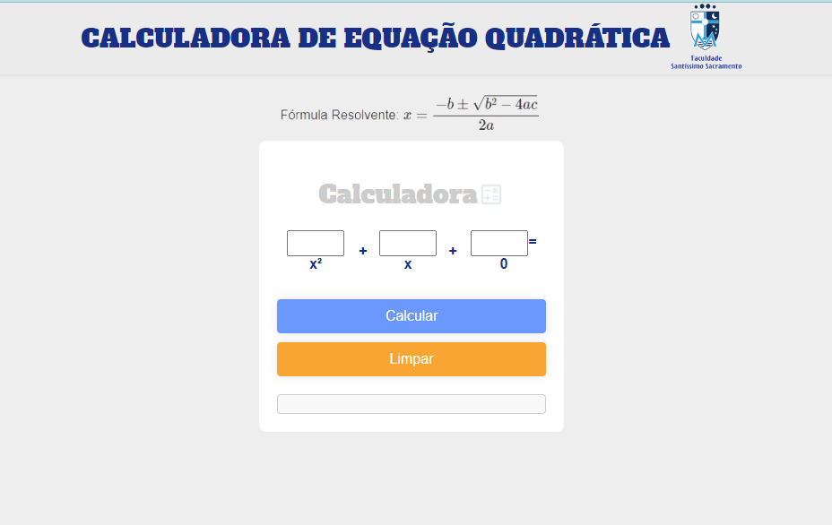

## Calculadora de Equação Quadrática



### Finalidade
Este projeto é uma calculadora de equação quadrática que permite aos usuários inserir os coeficientes de uma equação quadrática \(ax^2 + bx + c = 0\) e calcular as raízes da equação. Além de fornecer os valores das raízes e suas descrições.

### Usabilidade
1. **Inserção dos Coeficientes:** O usuário deve inserir os valores dos coeficientes \(a\), \(b\) e \(c\) nos campos correspondentes.
2. **Cálculo das Raízes:** Ao clicar no botão "Calcular", o sistema calcula o discriminante (delta) e as raízes da equação (se existirem), exibindo os resultados na tela.
3. **Limpar Campos:** O botão "Limpar" permite ao usuário apagar os valores inseridos e os resultados calculados, bem como limpar o gráfico.

### Tecnologias Utilizadas
- **HTML5:** Utilizado para a estruturação do conteúdo da página web.
- **CSS3:** Utilizado para estilização da interface, tornando-a visualmente agradável e responsiva.
- **JavaScript:** Utilizado para manipulação dinâmica do DOM e cálculos matemáticos.

#### Tecnologias com Logos
<p align="center">
    
    
    
</p>

### Estrutura do Projeto
O projeto está organizado da seguinte maneira:

```
Calculadora de Equação Quadrática/
│
├── index.html        # Estrutura principal da página
├── assets/
│   ├── css/
│   │   └── styles.css  # Arquivo de estilo
│   ├── js/
│   │   └── script.js   # Arquivo JavaScript
│   └── img/
│       ├── bg.png      # Imagem do logo da faculdade
│       ├── formula.png # Imagem da fórmula resolvente
│       └── si.png      # Logo de Sistemas de Informação
└── README.md          # Documentação do projeto
```

### Demonstração


https://github.com/WesleyBSa/calc-equacaoQuadratica/assets/88838006/6abb8dcb-ab9b-4097-b9fd-6702f9ed6180


### Como Executar o Projeto
1. Clone o repositório ou faça o download dos arquivos.
2. Abra o arquivo `index.html` em um navegador web.
3. Insira os valores de \(a\), \(b\) e \(c\).
4. Clique em "Limpar" para resetar os campos e o gráfico.

---

Desenvolvido pelo grupo 3 de [Sistemas de Informação](https://fsssacramento.br/sistemas-de-informacao.php).
